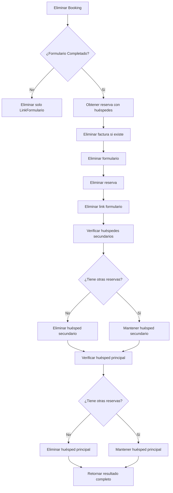

# Eliminación Inteligente de Huéspedes en Bookings

## Resumen

Se ha implementado una funcionalidad avanzada en el módulo `eliminar-booking` que verifica automáticamente si los huéspedes (principal y secundarios) quedan sin reservas después de eliminar un booking, y los marca como eliminados solo en ese caso.

## ✨ Funcionalidades Implementadas

### 1. Verificación Automática de Reservas Activas
- **Huéspedes Principal**: Se verifica si tiene otras reservas activas antes de eliminarlo
- **Huéspedes Secundarios**: Se verifica individualmente cada huésped secundario
- **Eliminación Condicional**: Solo se eliminan huéspedes sin reservas adicionales

### 2. Nuevos Métodos en Servicios

#### `HuespedesService`
```typescript
// Elimina huésped dentro de transacción
async removeTx(id: number, tx: Prisma.TransactionClient)

// Verifica si tiene reservas activas
async hasActiveReservationsTx(huespedId: number, tx: Prisma.TransactionClient): Promise<boolean>

// Elimina solo si no tiene reservas activas
async removeIfNoActiveReservationsTx(huespedId: number, tx: Prisma.TransactionClient)
```

#### `HuespedesSecundariosService`
```typescript
// Métodos equivalentes para huéspedes secundarios
async removeTx(id: number, tx: Prisma.TransactionClient)
async hasActiveReservationsTx(huespedSecundarioId: number, tx: Prisma.TransactionClient): Promise<boolean>
async removeIfNoActiveReservationsTx(huespedSecundarioId: number, tx: Prisma.TransactionClient)
```

#### `DocumentosService`
```typescript
// Eliminación de documentos en transacción
async removeAllByHuespedIdTx(huespedId: number, tx: Prisma.TransactionClient)
```

### 3. Respuesta Mejorada del Endpoint

#### Antes
```json
{
  "message": "Booking eliminado correctamente",
  "data": {
    "linkFormularioId": 1,
    "formularioId": 1,
    "reservaId": 1,
    "facturaId": 1
  }
}
```

#### Después
```json
{
  "message": "Booking eliminado correctamente",
  "data": {
    "linkFormularioId": 1,
    "formularioId": 1,
    "reservaId": 1,
    "facturaId": 1,
    "huespedPrincipalEliminado": true,
    "huespedesSecundariosEliminados": [2, 3]
  }
}
```

## 🔄 Flujo de Eliminación



## 📊 Casos de Uso

### Caso 1: Huéspedes con Reservas Múltiples
```typescript
// Booking con huéspedes que tienen otras reservas
const resultado = {
  "huespedPrincipalEliminado": false,  // Tiene otras reservas
  "huespedesSecundariosEliminados": [2] // Solo el ID 2 no tiene otras reservas
}
```

### Caso 2: Huéspedes sin Reservas Adicionales
```typescript
// Booking donde todos los huéspedes quedan sin reservas
const resultado = {
  "huespedPrincipalEliminado": true,   // No tiene otras reservas
  "huespedesSecundariosEliminados": [1, 2, 3] // Ninguno tiene otras reservas
}
```

### Caso 3: Sin Huéspedes Secundarios
```typescript
// Booking solo con huésped principal
const resultado = {
  "huespedPrincipalEliminado": true,
  "huespedesSecundariosEliminados": [] // Array vacío
}
```

## 🧪 Testing

Se han implementado **15 casos de prueba** que cubren:

### Tests Básicos
- ✅ Eliminación de booking no completado
- ✅ Eliminación de booking completado con factura
- ✅ Eliminación de booking completado sin factura

### Tests de Huéspedes
- ✅ Huéspedes que se eliminan (sin otras reservas)
- ✅ Huéspedes que se mantienen (con otras reservas)
- ✅ Booking sin huéspedes secundarios
- ✅ Verificación de transacciones correctas

### Tests de Casos de Borde
- ✅ Manejo de errores en transacciones
- ✅ Orden correcto de eliminaciones
- ✅ Validación de IDs diferentes
- ✅ Garantía de transacciones atómicas

## 📝 Documentación Swagger Actualizada

### Endpoint: `DELETE /eliminar-booking/:id`

#### Descripción Mejorada
- **Proceso detallado** de eliminación paso a paso
- **Casos de uso** claramente diferenciados
- **Eliminación inteligente** de huéspedes explicada
- **Ejemplos de respuesta** con nuevos campos

#### Nuevos Campos de Respuesta
- `huespedPrincipalEliminado`: `boolean` - Indica si el huésped principal fue eliminado
- `huespedesSecundariosEliminados`: `number[]` - Array con IDs de huéspedes secundarios eliminados

## 🔧 Dependencias Actualizadas

### Módulo `EliminarBookingModule`
```typescript
imports: [
  // ... módulos existentes
  HuespedesModule,              // ✨ Nuevo
  HuespedesSecundariosModule,   // ✨ Nuevo
]
```

## 🎯 Beneficios

### 1. **Integridad de Datos**
- Elimina huéspedes solo cuando es seguro hacerlo
- Mantiene relaciones correctas en la base de datos
- Evita huéspedes huérfanos o referencias rotas

### 2. **Información Detallada**
- El cliente conoce exactamente qué huéspedes fueron eliminados
- Permite auditoria y seguimiento de cambios
- Facilita la implementación de logs detallados

### 3. **Transacciones Atómicas**
- Todas las operaciones en una sola transacción
- Rollback automático en caso de errores
- Consistencia garantizada

### 4. **Rendimiento Optimizado**
- Verificaciones eficientes de reservas activas
- Eliminaciones en lote cuando es posible
- Consultas optimizadas con includes específicos

## 🚀 Implementación Técnica

### Patrón de Transacciones
```typescript
await this.prisma.$transaction(async (tx) => {
  // 1. Obtener datos completos de la reserva
  const reservaCompleta = await tx.reserva.findFirst({
    include: { huesped: true, huespedes_secundarios: true }
  });
  
  // 2. Eliminaciones principales
  await this.eliminarFactura(tx);
  await this.eliminarFormulario(tx);
  await this.eliminarReserva(tx);
  
  // 3. Verificación y eliminación inteligente de huéspedes
  const eliminados = await this.verificarYEliminarHuespedes(reservaCompleta, tx);
  
  return { ...resultado, ...eliminados };
});
```

### Verificación de Reservas Activas
```typescript
const tieneReservasActivas = await tx.reserva.count({
  where: {
    huespedId: huespedId,
    deleted: false,
    id: { not: reservaEliminada.id } // Excluir la reserva actual
  }
}) > 0;
```

## 📋 Checklist de Implementación

- ✅ Métodos de transacción en `HuespedesService`
- ✅ Métodos de transacción en `HuespedesSecundariosService`
- ✅ Método de transacción en `DocumentosService`
- ✅ Lógica de verificación de reservas activas
- ✅ Actualización del método `remove` en `EliminarBookingService`
- ✅ Nuevos campos en clases de respuesta
- ✅ Inyección de dependencias en módulo
- ✅ Tests completos (15 casos de prueba)
- ✅ Documentación Swagger actualizada
- ✅ Documentación técnica completa

## 🔄 Compatibilidad

Esta implementación es **totalmente retrocompatible**:
- No cambia el comportamiento para bookings no completados
- Agrega información adicional sin romper la estructura existente
- Los clientes existentes seguirán funcionando sin cambios

## 📚 Archivos Modificados

1. `src/huespedes/huespedes.service.ts` - Nuevos métodos de transacción
2. `src/huespedes-secundarios/huespedes-secundarios.service.ts` - Nuevos métodos de transacción
3. `src/documentos/documentos.service.ts` - Método de transacción para documentos
4. `src/eliminar-booking/eliminar-booking.service.ts` - Lógica principal actualizada
5. `src/eliminar-booking/eliminar-booking.module.ts` - Nuevas dependencias
6. `src/eliminar-booking/eliminar-booking.controller.ts` - Documentación Swagger mejorada
7. `src/eliminar-booking/eliminar-booking.service.spec.ts` - Tests completos actualizados 