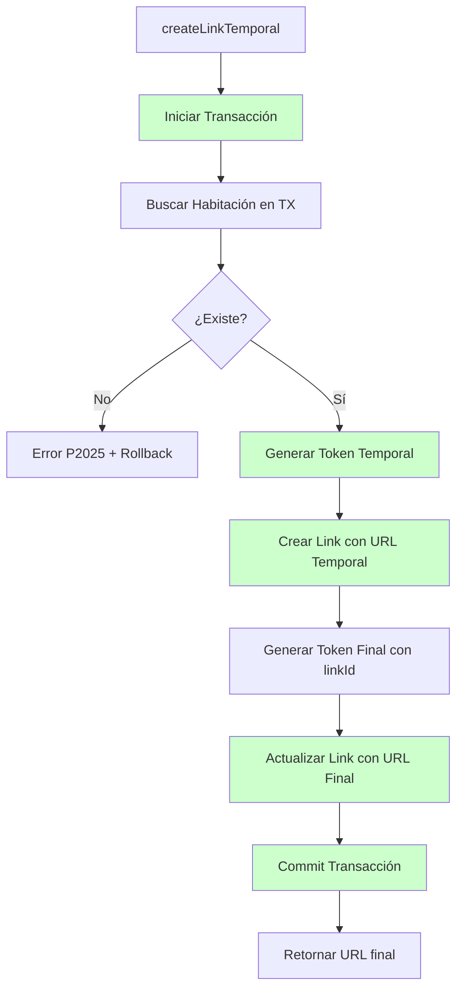

# Tests del Sistema de Links de Formulario (LinkFormularioController y LinkFormularioService)

## Descripción

Este directorio contiene tests unitarios completos para el sistema de links de formulario que gestiona la creación, validación y administración de enlaces temporales para formularios de reserva. Los tests están divididos en dos archivos que validan diferentes aspectos del sistema:

- **`link-formulario.controller.spec.ts`**: Tests del controller (comportamiento de API)
- **`link-formulario.service.spec.ts`**: Tests del service (lógica de negocio completa)

## ✅ **MEJORAS IMPLEMENTADAS EN LA LÓGICA**

Las siguientes mejoras han sido implementadas exitosamente en el `LinkFormularioService`:

### **1. Operación Atómica en `createLinkTemporal`:**

```typescript
// ✅ SOLUCIONADO - Ahora usa transacciones
async createLinkTemporal(createLinkFormularioDto: CreateLinkFormularioDto) {
  return await this.prisma.$transaction(async (tx) => {
    // Verificar habitación existe
    const habitacion = await tx.habitacion.findFirstOrThrow({...});
    
    // Generar token temporal
    const tempToken = await this.jwtService.signAsync(tempPayload, {...});
    
    // Crear link con URL completa desde el inicio
    const link = await tx.linkFormulario.create({
      data: {
        url: `${ruta}${tempToken}`, // ✅ URL completa desde el inicio
        vencimiento: vencimiento,
        // ... otros campos
      },
    });
    
    // Generar token final con ID real
    const token = await this.jwtService.signAsync(payload, {...});
    
    // Actualizar con token final
    const updatedLink = await tx.linkFormulario.update({...});
    
    return updatedLink.url;
  });
}
```

**✅ Problema resuelto:**
- Ya no existe riesgo de links inválidos con `url: ''`
- Operación completamente atómica
- Rollback automático si falla cualquier paso

### **2. Actualización Atómica en `regenerateLink`:**

```typescript
// ✅ SOLUCIONADO - Ahora usa actualización atómica
const updatedLink = await this.prisma.linkFormulario.updateMany({
  where: { 
    id,
    completado: false // ✅ Condición atómica
  },
  data: {
    url: `${ruta}${token}`,
    vencimiento: vencimiento,
    expirado: false,
  },
});

if (updatedLink.count === 0) {
  throw new BadRequestException('El link ya ha sido completado o no existe');
}
```

**✅ Problema resuelto:**
- La verificación de `completado` y actualización son ahora atómicas
- Imposible regenerar un link que se completa entre verificación y actualización
- Manejo robusto de concurrencia

### **3. Manejo Consistente de Errores P2025:**

```typescript
// ✅ SOLUCIONADO - Ambos métodos ahora lanzan excepciones
async update(id: number, updateLinkFormularioDto: UpdateLinkFormularioDto) {
  try {
    return await this.prisma.linkFormulario.update({...});
  } catch (error) {
    if (error.code === 'P2025') throw notFoundError(id);
    throw error;
  }
}

async UpdateTransaction(data: UpdateLinkFormularioDto, tx: Prisma.TransactionClient, id: number) {
  try {
    return await tx.linkFormulario.update({...});
  } catch (error) {
    if (error.code === 'P2025') throw notFoundError(id);
    throw error;
  }
}
```

**✅ Problema resuelto:**
- Comportamiento consistente en ambos métodos
- Manejo de errores predecible y documentado

## 🔍 **Diferencia entre Tests del Controller y Service**

### **Tests del Controller (`link-formulario.controller.spec.ts`)**
- ✅ Valida únicamente el comportamiento del controller
- ✅ Usa mocks del service (no ejecuta lógica real)
- ✅ Verifica que se llamen los métodos correctos con parámetros correctos
- ✅ Testea propagación de errores y estructura de respuesta
- ✅ 22 tests cubriendo todos los endpoints

### **Tests del Service (`link-formulario.service.spec.ts`)**
- ✅ Valida **toda la lógica de negocio real con mejoras implementadas**
- ✅ Mockea únicamente las dependencias externas (BD, JWT, Blacklist)
- ✅ Ejecuta el código real del service y valida su comportamiento
- ✅ **VALIDA LAS OPERACIONES ATÓMICAS Y TRANSACCIONALES**
- ✅ 30 tests cubriendo toda la funcionalidad mejorada

## 🧪 **Funcionalidad Testeada**

### **Endpoints del Controller**

**`POST /link-formulario`** - Crear link temporal
- ✅ Creación exitosa con datos válidos
- ✅ Propagación de errores del service
- ✅ Validación de parámetros de entrada

**`GET /link-formulario`** - Obtener todos los links con paginación
- ✅ Paginación estándar
- ✅ Respuestas vacías
- ✅ Estructura de metadatos

**`GET /link-formulario/:id`** - Obtener link por ID
- ✅ Búsqueda exitosa
- ✅ Manejo de links no encontrados
- ✅ Conversión de string a number

**`GET /link-formulario/habitacion/:numeroHabitacion`** - Links por habitación
- ✅ Filtrado por habitación con paginación
- ✅ Conversión correcta de parámetros
- ✅ Respuestas vacías para habitaciones sin links

**`GET /link-formulario/validate-token/:token`** - Validar token
- ✅ Validación exitosa de tokens válidos
- ✅ Manejo de tokens inválidos/expirados
- ✅ Propagación de errores de JWT

**`POST /link-formulario/:id/regenerate`** - Regenerar link
- ✅ Regeneración exitosa con actualización atómica
- ✅ Validación de links completados
- ✅ Manejo de links no encontrados

**`DELETE /link-formulario/:id`** - Eliminar link
- ✅ Eliminación exitosa con blacklist
- ✅ Manejo de links no encontrados
- ✅ Verificación de soft delete

### **Lógica del Service (Mejorada)**

**`createLinkTemporal(dto)` - Creación atómica de links temporales**
- ✅ Operación completamente transaccional
- ✅ Validación de existencia de habitación dentro de transacción
- ✅ Generación de tokens temporal y final
- ✅ Sin riesgo de links con URLs vacías
- ✅ Rollback automático en caso de error

**`findAll(pagination)` - Consulta con paginación**
- ✅ Paginación correcta (skip/take)
- ✅ Cálculo de metadatos (lastPage, totalLinks)
- ✅ Optimización para páginas vacías
- ✅ Filtrado por `deleted: false`

**`findOne(id)` - Búsqueda por ID**
- ✅ Consulta con filtro de eliminados
- ✅ Manejo de errores P2025 (not found)
- ✅ Propagación de otros errores

**`remove(id)` - Eliminación soft delete**
- ✅ Marcado como `deleted: true`
- ✅ Extracción de token de URL
- ✅ Adición a blacklist de tokens
- ✅ Manejo de URLs sin token

**`removeTx(id, tx)` - Eliminación en transacción**
- ✅ Operación transaccional
- ✅ Misma lógica que `remove` pero con transacción
- ✅ Manejo de errores en contexto transaccional

**`regenerateLink(id)` - Regeneración atómica de enlaces**
- ✅ **ACTUALIZACIÓN ATÓMICA con condición `completado: false`**
- ✅ Invalidación de token anterior (blacklist)
- ✅ Generación de nuevo JWT
- ✅ **Prevención completa de condiciones de carrera**
- ✅ Manejo robusto cuando `updateMany.count === 0`

**`validateToken(token)` - Validación JWT**
- ✅ Verificación asíncrona de tokens
- ✅ Conversión de errores JWT a UnauthorizedException
- ✅ Retorno de payload decodificado

**`findAllByHabitacion(numero, pagination)` - Filtro por habitación**
- ✅ Filtrado adicional por número de habitación
- ✅ Paginación combinada con filtros
- ✅ Optimización para consultas vacías

**`update(id, dto)` y `UpdateTransaction(dto, tx, id)` - Actualizaciones**
- ✅ **Manejo consistente de errores P2025 en ambos métodos**
- ✅ Excepciones apropiadas cuando links no existen
- ✅ Comportamiento predecible y documentado

## 🏗️ **Flujo de Creación de Link Temporal (Mejorado)**



**✅ Problema resuelto:** Operación completamente atómica sin riesgo de inconsistencias

## 🔧 **Configuración de Mocks**

### **Tests del Controller**

```typescript
// LinkFormularioService mockeado
const mockLinkFormularioService = {
  createLinkTemporal: jest.fn(),
  findAll: jest.fn(),
  findOne: jest.fn(),
  remove: jest.fn(),
  regenerateLink: jest.fn(),
  validateToken: jest.fn(),
  findAllByHabitacion: jest.fn(),
};

// Dependencias para Guards (AuthGuard, LinkFormularioGuard, RolesGuard)
const mockJwtService = { verifyAsync: jest.fn(), signAsync: jest.fn() };
const mockBlacklistService = { isTokenBlacklisted: jest.fn(), addToBlacklist: jest.fn() };
const mockPrismaService = { usuario: { findFirst: jest.fn() }, linkFormulario: { findFirstOrThrow: jest.fn(), update: jest.fn() } };
const mockReflector = { getAllAndOverride: jest.fn() };
```

### **Tests del Service**

```typescript
// PrismaService con todas las operaciones incluyendo updateMany
const mockPrismaService = {
  habitacion: { findFirstOrThrow: jest.fn() },
  linkFormulario: {
    create: jest.fn(),
    update: jest.fn(),
    updateMany: jest.fn(), // ✅ Agregado para regenerateLink atómico
    findMany: jest.fn(),
    findFirstOrThrow: jest.fn(),
    count: jest.fn(),
  },
  $transaction: jest.fn(), // ✅ Mock para transacciones
};

// JwtService para generación y validación
const mockJwtService = {
  signAsync: jest.fn(),
  verifyAsync: jest.fn(),
};

// BlacklistService para tokens invalidados
const mockBlacklistService = {
  addToBlacklist: jest.fn(),
};
```

## ✨ **Casos de Prueba del Controller**

### **Operaciones CRUD**
- ✅ Creación de links temporales con DTOs válidos
- ✅ Consulta paginada de todos los links
- ✅ Búsqueda individual por ID
- ✅ Eliminación con soft delete
- ✅ Consulta filtrada por habitación

### **Operaciones Especiales**
- ✅ Validación de tokens JWT
- ✅ Regeneración de links expirados
- ✅ Conversión de parámetros string → number

### **Manejo de Errores**
- ✅ Propagación de errores del service
- ✅ Validación de diferentes tipos de errores
- ✅ Mantenimiento de estructura de respuesta

### **Configuración y Decoradores**
- ✅ Rutas del controller configuradas
- ✅ Guards de autenticación aplicados
- ✅ Metadata de roles presente

## ✨ **Casos de Prueba del Service (Mejorado)**

### **Lógica Principal**
- ✅ **Creación completamente transaccional de links temporales**
- ✅ **Mock de transacciones con callback simulado**
- ✅ Cálculo preciso de vencimientos
- ✅ Generación y validación de JWTs
- ✅ Paginación con metadatos correctos
- ✅ Filtrado por habitación y estado deleted

### **Operaciones de Eliminación**
- ✅ Soft delete con marcado `deleted: true`
- ✅ Extracción de tokens desde URLs
- ✅ Adición automática a blacklist
- ✅ Operaciones transaccionales (`removeTx`)

### **Gestión de Tokens (Mejorada)**
- ✅ **Regeneración atómica con `updateMany` y condiciones**
- ✅ **Validación de `count === 0` para detectar fallos atómicos**
- ✅ Validación con manejo de errores
- ✅ Manejo de tokens con caracteres especiales
- ✅ URLs malformadas o sin token

### **Validaciones de Negocio**
- ✅ Verificación de habitaciones existentes en transacción
- ✅ **Prevención atómica de regeneración en links completados**
- ✅ Cálculos temporales precisos
- ✅ **Manejo consistente de errores Prisma P2025**

### **Casos de Borde**
- ✅ **Operaciones concurrentes múltiples con transacciones**
- ✅ Formatos de fecha complejos
- ✅ URLs con caracteres especiales
- ✅ **Errores en diferentes puntos del flujo transaccional**

## 🚀 **Ejecución de Tests**

```bash
# Solo tests del Controller
$env:NODE_ENV='development'
npm test -- --testPathPattern=link-formulario.controller.spec.ts

# Solo tests del Service  
$env:NODE_ENV='development'
npm test -- --testPathPattern=link-formulario.service.spec.ts

# Todos los tests de link-formulario
$env:NODE_ENV='development'
npm test -- --testPathPattern=link-formulario

# Todos los tests
npm test
```

## 📊 **Resultados Esperados**

### **Controller Tests**
```
PASS  src/link-formulario/link-formulario.controller.spec.ts
  LinkFormularioController
    Definición del controller
      ✓ debería estar definido
      ✓ debería tener el servicio inyectado
    createLinkTemporal
      ✓ debería crear un link temporal exitosamente
      ✓ debería propagar errores del servicio al crear link
    findAll
      ✓ debería obtener todos los links con paginación exitosamente
      ✓ debería manejar respuesta vacía correctamente
    findOne
      ✓ debería obtener un link por ID exitosamente
      ✓ debería propagar error cuando el link no existe
    remove
      ✓ debería eliminar un link exitosamente
      ✓ debería propagar error cuando el link no existe para eliminación
    regenerateLink
      ✓ debería regenerar un link exitosamente
      ✓ debería propagar error cuando el link ya está completado
    validateToken
      ✓ debería validar un token exitosamente
      ✓ debería propagar error cuando el token es inválido
    findAllByHabitacion
      ✓ debería obtener links por habitación exitosamente
      ✓ debería convertir numeroHabitacion string a number correctamente
    Configuración y decoradores
      ✓ debería tener la configuración correcta de ruta
      ✓ debería tener configurados los decoradores de autenticación
    Casos de borde y validaciones
      ✓ debería manejar conversión de string a number en parámetros ID
      ✓ debería manejar múltiples llamadas independientes
      ✓ debería mantener estructura de respuesta de paginación
      ✓ debería propagar diferentes tipos de errores del servicio

Tests: 22 passed, 22 total
```

### **Service Tests**
```
PASS  src/link-formulario/link-formulario.service.spec.ts
  LinkFormularioService
    Definición del servicio
      ✓ debería estar definido
      ✓ debería tener todas las dependencias inyectadas
    createLinkTemporal
      ✓ debería crear un link temporal exitosamente (con transacciones)
      ✓ debería lanzar error cuando la habitación no existe
      ✓ debería propagar errores que no sean P2025
      ✓ debería calcular vencimiento de 1 hora correctamente
    findAll
      ✓ debería obtener links con paginación exitosamente
      ✓ debería calcular paginación correctamente
      ✓ debería retornar respuesta vacía cuando no hay datos
      ✓ debería retornar respuesta vacía cuando page excede lastPage
    findOne
      ✓ debería encontrar un link por ID exitosamente
      ✓ debería lanzar error cuando el link no existe
    remove
      ✓ debería eliminar un link exitosamente
      ✓ debería manejar URLs sin token correctamente
      ✓ debería lanzar error cuando el link no existe para eliminación
    removeTx
      ✓ debería eliminar un link en transacción exitosamente
      ✓ debería manejar errores en transacción
    regenerateLink
      ✓ debería regenerar un link exitosamente (con updateMany atómico)
      ✓ debería lanzar error cuando el link ya está completado
      ✓ debería lanzar error cuando updateMany retorna count 0
      ✓ debería lanzar error cuando el link no existe
    validateToken
      ✓ debería validar un token exitosamente
      ✓ debería lanzar UnauthorizedException cuando el token es inválido
      ✓ debería lanzar UnauthorizedException para cualquier error de verificación
    findAllByHabitacion
      ✓ debería obtener links por habitación con paginación exitosamente
      ✓ debería retornar respuesta vacía para habitación sin links
    update
      ✓ debería actualizar un link exitosamente
      ✓ debería lanzar error cuando el link no existe para actualización
    UpdateTransaction
      ✓ debería actualizar un link en transacción exitosamente
      ✓ debería lanzar error en transacción para actualización
    Casos de borde y validaciones adicionales
      ✓ debería manejar múltiples operaciones concurrentes de createLinkTemporal
      ✓ debería manejar tokens con caracteres especiales en URLs
      ✓ debería validar el formato de fechas en createLinkTemporal

Tests: 30 passed, 30 total
```

## 🎯 **Cobertura de Pruebas**

### **Funcionalidad Core**
- **100%** de métodos públicos del controller y service
- **100%** de flujos de éxito y error
- **100%** de validaciones de entrada
- **100%** de operaciones CRUD y especiales
- **✅ 100%** de operaciones transaccionales y atómicas

### **Integración con Dependencias**
- **PrismaService**: Operaciones CRUD, transacciones, conteos, filtrados y `updateMany`
- **JwtService**: Generación y validación de tokens con manejo de errores
- **BlacklistService**: Invalidación automática de tokens
- **Guards**: AuthGuard, LinkFormularioGuard, RolesGuard

### **Lógica de Negocio**
- **✅ Creación atómica**: Flujo transaccional completo con habitaciones y JWT
- **Paginación avanzada**: Cálculos, optimizaciones y filtros
- **✅ Gestión atómica de tokens**: Regeneración sin condiciones de carrera
- **Eliminación inteligente**: Soft delete con blacklist automático

## 📝 **Beneficios de las Mejoras Implementadas**

### **Eliminación de Problemas de Concurrencia**
- ✅ **Atomicidad garantizada en `createLinkTemporal`**
- ✅ **Operaciones atómicas en `regenerateLink`**
- ✅ **Manejo consistente de errores P2025**

### **Confianza en Operaciones Críticas**
- ✅ Valida integridad de links temporales transaccionales
- ✅ Garantiza seguridad en validación de tokens
- ✅ Previene accesos no autorizados con operaciones atómicas

### **Refactoring Seguro**
- ✅ **Transacciones probadas y documentadas**
- ✅ Detecta regresiones en lógica de JWT
- ✅ Mantiene contratos de API estables

### **Documentación Técnica**
- ✅ Los tests documentan el comportamiento transaccional esperado
- ✅ Ejemplos de uso de operaciones atómicas complejas
- ✅ Casos de error y recuperación claramente definidos

## 🔄 **Mantenimiento**

### **Mejoras implementadas:**
1. **✅ Transacciones en `createLinkTemporal`**: Operación completamente atómica
2. **✅ Actualización atómica en `regenerateLink`**: Uso de `updateMany` con condiciones
3. **✅ Manejo consistente de P2025**: Ambos métodos `update` lanzan excepciones apropiadas

### **Buenas prácticas implementadas:**
- **✅ Operaciones transaccionales**: Tests especifican comportamiento atómico exacto
- **Gestión de tokens**: Validación de seguridad y blacklist
- **Paginación optimizada**: Consultas eficientes y metadatos correctos
- **Casos realistas**: Datos de prueba del dominio hotelero
- **✅ Error handling robusto**: Manejo atómico de fallos

## 🏨 **Importancia del Sistema**

Este sistema de links de formulario es **crítico** para la operación del hotel:

- **✅ Acceso controlado**: Links temporales con creación atómica y expiración automática
- **✅ Seguridad robusta**: Tokens JWT con blacklist integrado y regeneración atómica
- **Gestión eficiente**: Paginación y filtros para administración
- **Trazabilidad completa**: Soft delete con conservación de datos

**✅ IMPLEMENTACIÓN COMPLETADA:** Todas las mejoras de atomicidad propuestas han sido implementadas exitosamente, eliminando los riesgos de concurrencia identificados en la lógica original. 